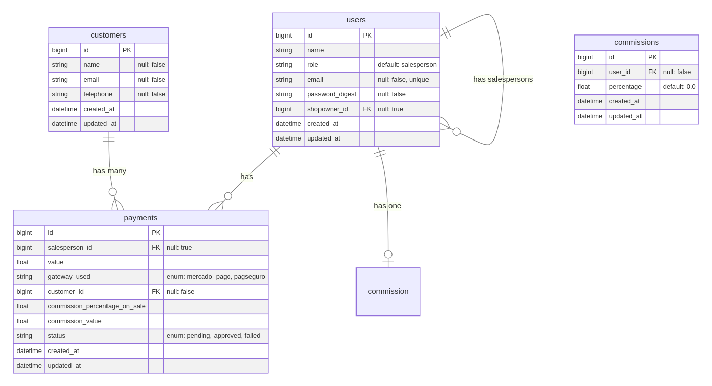

# Projeto de Gestão de Vendedores e Pagamentos (The Store)

Este projeto faz parte de uma aplicação para a gestão de vendedores e pagamentos, com controle de acesso baseado em diferentes perfis de usuários, como Lojista e Vendedor. A aplicação permite que os usuários acessem informações relacionadas ao seu papel (como visualização e cadastro de vendedores e pagamentos), de forma dinâmica. Esta parte é o Backend do projeto.

## Algumas Funcionalidades

- **Login de Usuário**: Autenticação baseada em JWT.
- **Gestão de Vendedores**: Permite que Lojistas vejam e cadastrem Vendedores.
- **Gestão de Pagamentos**: Vendedores podem visualizar seus pagamentos.
- **Controle de Acesso**: Diferentes níveis de acesso para Lojistas e Vendedores.

## Como Rodar o Projeto

### Antes, voce vai precisar...

De ter a versão [Ruby 3.3.5](https://www.ruby-lang.org/en/documentation/installation/) instalada na sua máquina, e assim siga os passos:

1. Clone o repositório:
   ```bash
   git clone https://github.com/thiagochirana/the-store-backend.git
   cd the-store-backend
   ```
2. Instale as dependências:

   ```bash
   bundle install
   ```

3. Configure o banco de dados:
   ```bash
   rails db:prepare
   ```
4. Inicie o Server:
   ```bash
   rails server
   ```

## Implementação e Decisões de Arquitetura

### Backend - Ruby on Rails

Algumas das principais decisões de arquitetura incluem:

#### 1. **Autenticação e Autorização**

A autenticação dos usuários é realizada utilizando **JWT (JSON Web Tokens)**. O JWT é gerado durante o processo de login e é usado para autenticar os usuários em requisições subsequentes.

#### 2. **Controle de Acesso (Roles)**

Com base no papel do usuário, o acesso a determinadas rotas é controlado. Utilizei um middleware simples (`authentication.rb`) própro que o Rails 8 gera para verificar o `role` do usuário antes de permitir o acesso a determinadas rotas.

- **Lojista (Lojista)**: Tem acesso a todas as funcionalidades, incluindo a visualização e o cadastro de vendedores e pagamentos.
- **Vendedor (Vendedor)**: Tem acesso restrito, com permissão apenas para ver os pagamentos associados a ele.

#### 3. **Estrutura do Banco de Dados**

O banco de dados foi modelado com **tabelas relacionadas** para refletir as entidades principais do sistema, como **Usuários**, **Vendedores** e **Pagamentos**.

- **Users (Usuários)**: Contêm informações sobre os usuários, incluindo o tipo de usuário (Lojista ou Vendedor).
- **Payments (pagamentos)**: Só podem ser gerenciados por Lojistas, refletindo a hierarquia de permissões do sistema.
- **Commissions (comissões)**: Armazenar as as configurações de comissões do Vendedor apenas
- **Customers (Clientes)**: Armazenar dados de clientes.

#### Diagrama Relacional das Tabelas



#### 4. **Testes**

O projeto também adota testes automatizados com **RSpec** para garantir que as funcionalidades do backend sejam validadas adequadamente.

#### 5. **Decisões de Design**

- **o "jeito Rails" (Rails Way)**: busquei o máximo usar apenas o que o Rails proporciona, sem criar outras layers como services por exemplo, assim deixando o projeto mais simples possível. Toda lógica está nos controllers e models. No máximo a lógica de autenticação está em um concern (o `authentication.rb`) porém o próprio Rails 8 o constrói para tal, logo, não foge do conceito de Rails Way. Para banco de dados não vi necessidade de implementar algum banco diferente do padrão que é SQLite3, tendo em vista que não é necessário um banco "robusto" neste momento.
